 ## Step 1: Install VirtualBox

 ## Step 2:Download VirtualBox Platform Packages & VirtualBox Extension Pack

## Click next
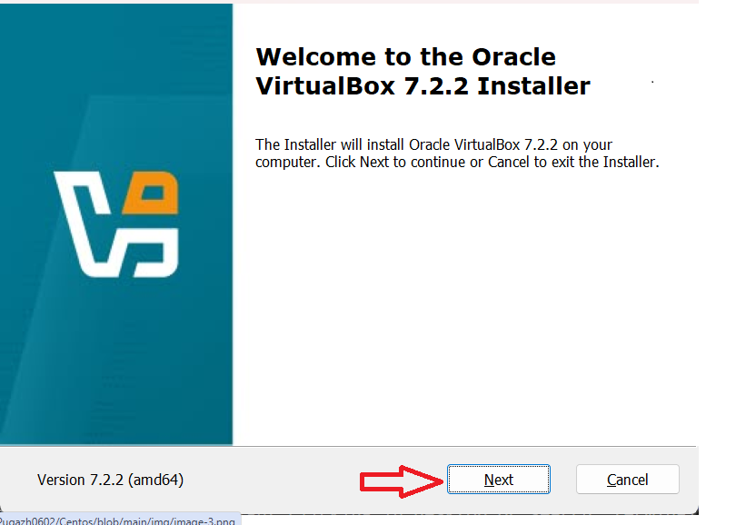
## Click next

## Click next
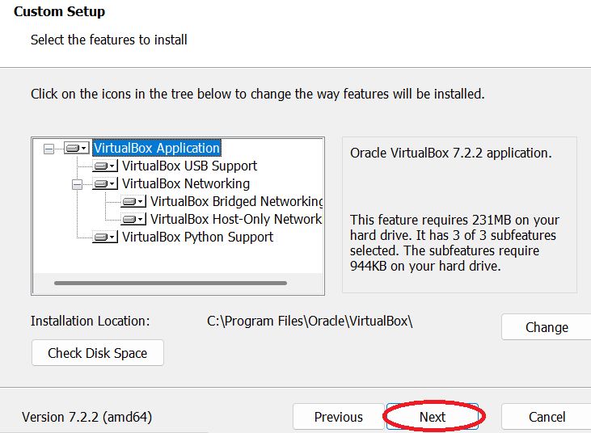
## Click start
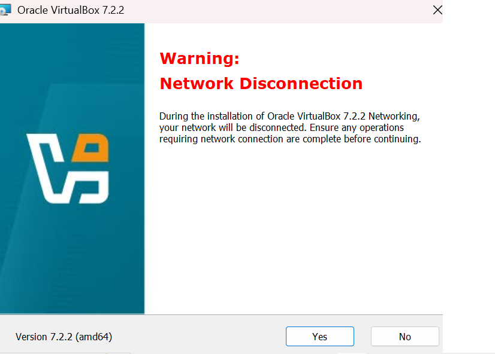
## Click yes
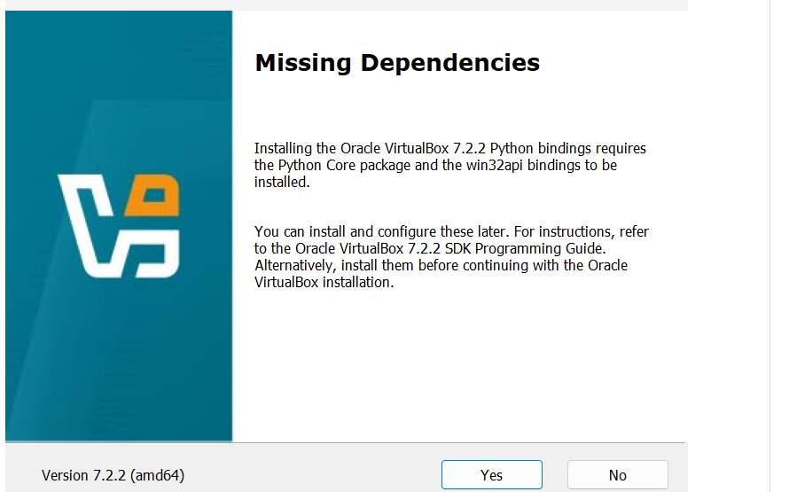
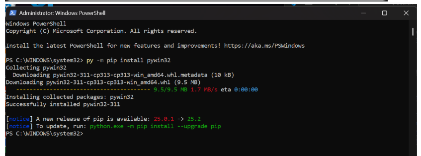
## Click next
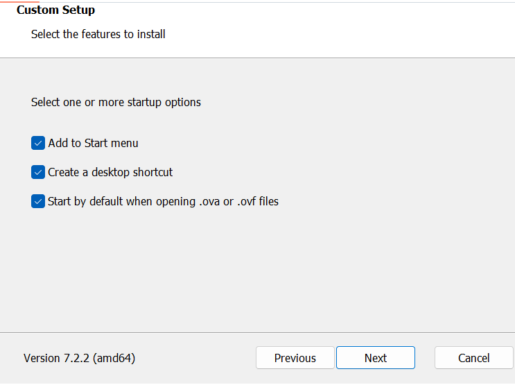
## Click finish
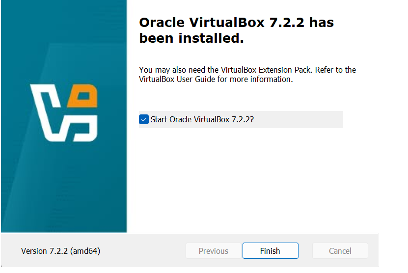
## Step 2: Download Centos from Url:https://drive.google.com/file/d/1QXdagFhT5kchGL-iLlDSkcN2RqIskLmX/view or Url:https://www.centos.org/download/
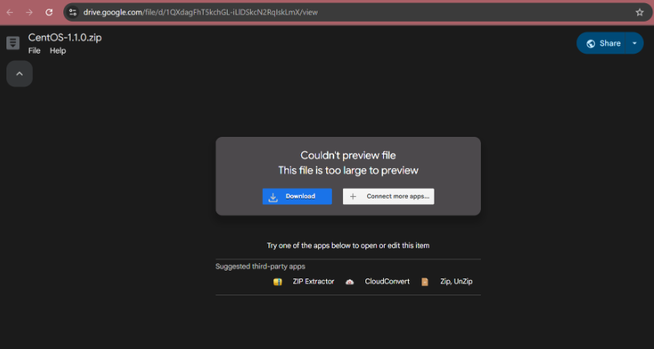
## Step 3: Extract the Centos Iso & Double Click the Iso file. The VM will automatically run the Centos.
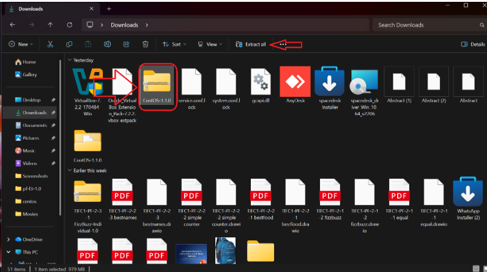
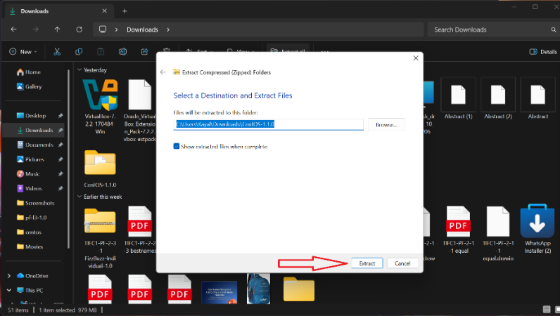
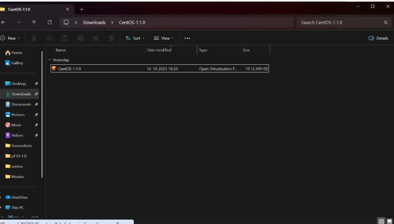
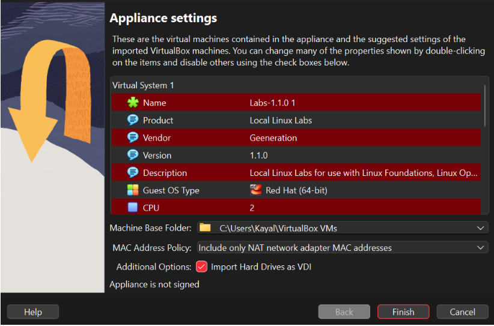
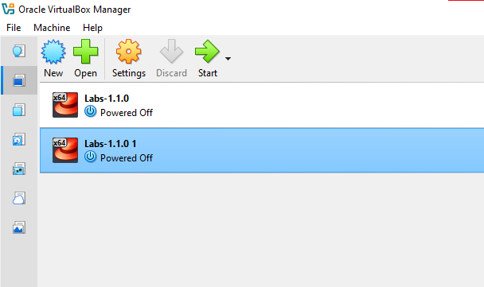
## step 4: Setup network in VM Box and Starting centos
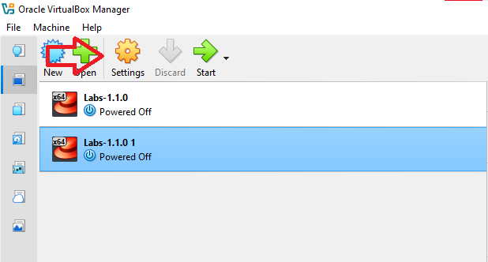
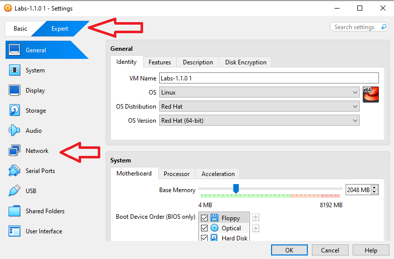
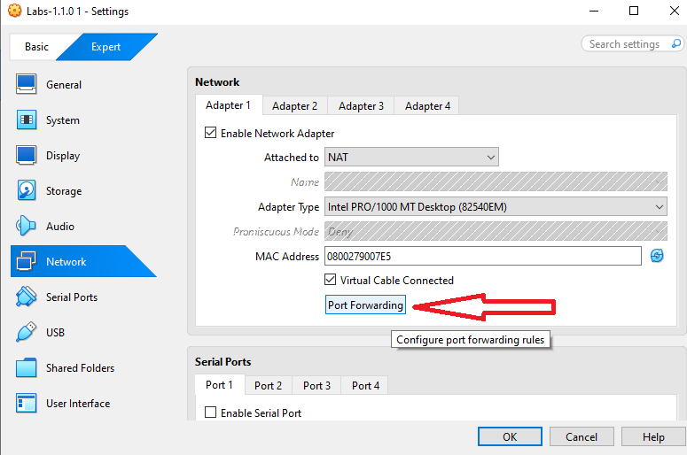
Set http values as shown in the Image
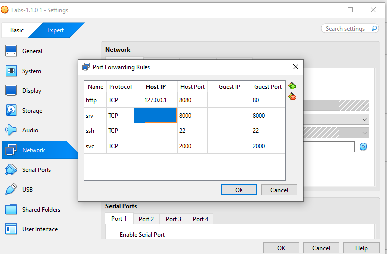
